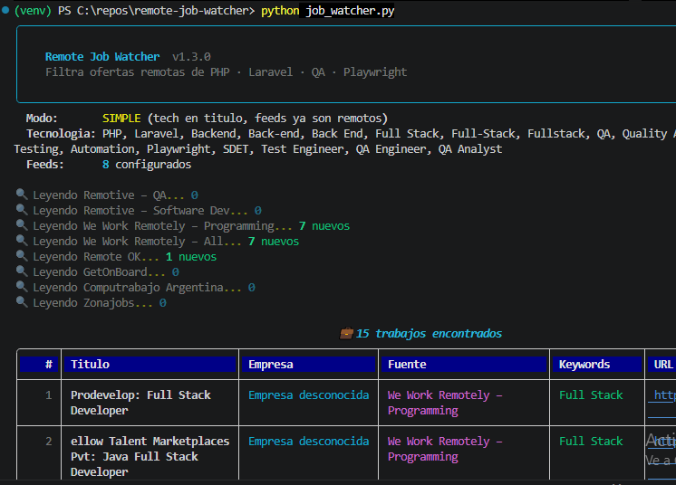
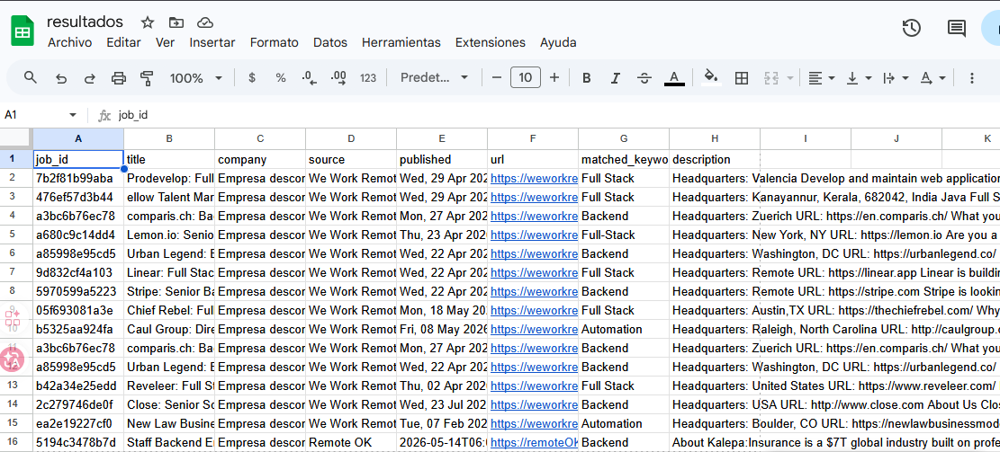
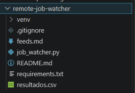

# 📡 Remote Job Watcher

[](https://python.org)
[](LICENSE)
[](feeds.md)

Lee ofertas laborales desde RSS feeds públicos, filtra por keywords y guarda los resultados en CSV.

---

## ¿Qué hace?

- 📥 Lee múltiples RSS feeds de trabajo remoto simultáneamente
- 🔍 Filtra por keywords configurables (QA, Playwright, Laravel, etc.)
- 🎨 Muestra resultados en tabla con colores en la terminal
- 💾 Guarda resultados en `resultados.csv` sin duplicados
- 🔁 Recuerda qué trabajos ya vio (no te muestra lo mismo dos veces)

---

## Instalación

### 1. Clonar el repositorio

```bash
git clone https://github.com/cerge/remote-job-watcher.git
cd remote-job-watcher
```

### 2. Crear entorno virtual (recomendado)

```bash
# Crear
python -m venv venv

# Activar en Mac/Linux
source venv/bin/activate

# Activar en Windows
venv\Scripts\activate
```

### 3. Instalar dependencias

```bash
pip install -r requirements.txt
```

---

## Uso

```bash
python job_watcher.py
```

**Output esperado:**

```
╭─────────────────────────────────────────╮
│   Remote Job Watcher                    │
│   Lee RSS feeds de trabajo remoto...    │
╰─────────────────────────────────────────╯

Keywords: QA, Playwright, Laravel, Automation, Remote
Feeds: 5 configurados

🔍 Leyendo We Work Remotely – Programming... 3 nuevos
🔍 Leyendo Remotive... 7 nuevos
...

╭──────── 10 trabajos encontrados ────────╮
│ # │ Título            │ Empresa │ Keywords         │
│ 1 │ QA Engineer       │ Acme    │ QA, Automation   │
│ 2 │ Playwright Tester │ Corp    │ Playwright, QA   │
 ╰──────────────────────────────────────────╯
 ```

---

## Screenshots

### Terminal output


### Results saved to CSV


### Project structure


---

## Configuración

Todo lo que podés personalizar está en las primeras líneas de `job_watcher.py`:

### Keywords

```python
KEYWORDS = [
    "QA",
    "Playwright",
    "Laravel",
    "Automation",
    "Remote",
    # Agregá las tuyas acá
]
```

### RSS Feeds

```python
RSS_FEEDS = [
    {
        "name": "Mi Feed",
        "url": "https://ejemplo.com/jobs.rss",
    },
    # Ver feeds.md para más opciones
]
```

### CSV de salida

```python
OUTPUT_CSV = "resultados.csv"      # Nombre del archivo de salida
ONLY_NEW_JOBS = True               # True = solo trabajos que no viste antes
```

---

## Estructura del proyecto

```
remote-job-watcher/
├── job_watcher.py      # Script principal (todo el código)
├── requirements.txt    # Dependencias Python
├── feeds.md            # Lista de RSS feeds disponibles
├── resultados.csv      # Generado automáticamente al correr
├── .gitignore
└── README.md
```

---

## Dependencias

| Librería | Versión | Para qué |
|----------|---------|----------|
| `feedparser` | 6.0.11 | Leer y parsear RSS/Atom feeds |
| `rich` | 13.7.1 | Tablas y colores en la terminal |

Solo 2 dependencias. Sin frameworks, sin base de datos, sin complejidad innecesaria.

---

## Hoja de ruta

El proyecto está pensado para crecer de a pasos:

- [x] **v1.0** — RSS + filtro + CSV + output en consola
- [ ] **v1.1** — Alertas a Telegram cuando hay trabajos nuevos
- [ ] **v1.2** — Resúmenes con IA (OpenAI / Claude API)
- [ ] **v1.3** — Scraping con Playwright para boards sin RSS
- [ ] **v2.0** — Docker + GitHub Actions (corre automático todos los días)
- [ ] **v2.1** — Base de datos SQLite para historial completo

---

## Licencia

MIT — libre para usar, modificar y distribuir.
